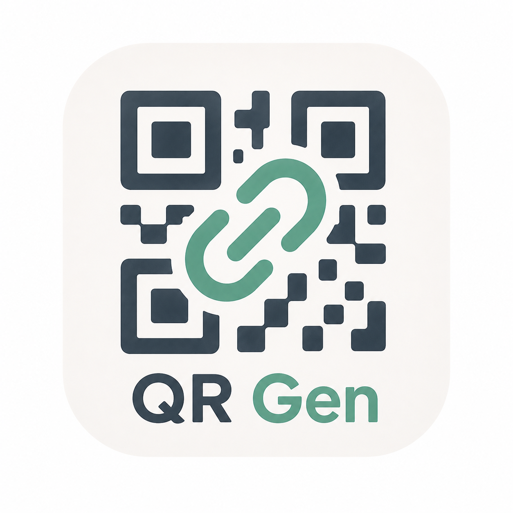

# 🎨 Premium QR Studio — 專業設計師級 QR Code 設計工作站

<div align="center">
  
  <br />
  <p><strong>專為設計師與品牌打造的高解析、高品質條碼美化生成平台</strong></p>
  <p><em>An elegant, high-resolution QR Code studio tailored for designers and brands.</em></p>
</div>

---

## ✨ 核心特色 (Core Features)

### 🎨 卓越的設計美學 (Elite Design Aesthetics)
* **LOGO 色彩語彙整合**：採用極具質感的**翡翠綠 (Sage Green)**、**深石板藍 (Slate Blue)** 與**溫潤奶油白 (Cream)** 進行介面重構，視覺高級且和諧。
* **設計師畫布 (Artboard Canvas)**：右側預覽區採用專業設計軟體（如 Figma/Sketch）的**半透明格線背景**，並提供網格開關，方便檢視透明背景條碼。
* **極致微互動**：介面加入毛玻璃 (Glassmorphic) 控制面板與平滑流暢的滑桿、按鈕動畫。

### ⚙️ 強大的參數自訂 (Powerful Customization)
* **快速色彩預設組合 (Quick Presets)**：一鍵套用 `QR Gen 經典`、`翡翠薄荷`、`森林暗奢` 與 `香檳摩登` 等多種極致配色。
* **條碼與畫布雙層色彩設定**：可單獨自訂 QR Code 二維碼本體的前景色/背景色，並與底圖海報背景、描述文字顏色完美相容。
* **進階中心標誌 (LOGO) 控制**：
  * 可切換**「預設 QR Gen LOGO」**、**「上傳自訂圖片」**與**「不使用標誌」**三種展示模式。
  * 新增 **圓角半徑控制滑桿 (Border Radius)**，可將 LOGO 裁切為完美的圓形、滑順圓角或俐落方角。
  * 自動繪製對應條碼底色的 Logo 卡片遮罩，防止條碼因 Logo 重疊而無法讀取。
* **高品質 Retina 渲染**：自動適應 Retina 螢幕進行高 DPR 像素縮放繪製，產出邊緣無毛邊的**高清 PNG** 條碼海報。

### ⚡ 效率工作流 (Efficient Workflow)
* **一鍵複製至剪貼簿 (Copy to Clipboard)**：串接 Clipboard API，點擊「複製圖片」即可直接貼到 LINE、Slack、Figma、Photoshop 等軟體，免去重複下載垃圾檔案的煩惱。
* **無縫響應式佈局 (Fully Responsive)**：完美支援手機與桌機，在行動端提供「收合預覽」功能，保證絕佳的單手操作體驗。

---

## 🛠 技術底座 (Tech Stack)

* **結構與佈局 (Markup & Layout)**: HTML5 Semantic Markup
* **風格樣式 (Styling)**: Vanilla CSS3 (Custom Properties, Flexbox, CSS Grid, Glassmorphism, Backdrop-filters)
* **字型導入 (Typography)**: Google Fonts (`Plus Jakarta Sans` / `Noto Sans TC`)
* **條碼引擎 (QR Engine)**: `QRCode.js` (H-level 容錯，可自訂 Module 色彩)
* **架構特性**: 純前端無後端依賴、PWA 離線支援 (Standalone Mode)

---

## 🚀 快速開始 (Quick Start)

### 1. 本地直接執行 (Local Standalone)
本專案為無後端純前端設計，您可以直接在瀏覽器中雙擊打開 `index.html` 即可開始使用！

### 2. 使用開發伺服器運行 (Recommended)
為了最佳的 PWA 體驗和網路圖片存取權限，推薦使用輕量伺服器運行：

```bash
# 使用 Node.js 的 serve 工具
npx serve .

# 或者使用 Python 內建伺服器
python -m http.server 8000
```
開啟瀏覽器並造訪 `http://localhost:5000` 或 `http://localhost:8000` 即可開始設計。

---

## ⚙️ 二維碼自訂參數指南 (Design Guide)

1. **二維碼大小 (QR Code Size)**：建議維持在 `280px` - `350px` 以取得最平衡的視覺比例。
2. **容錯級別 (Correction Level)**：預設強制啟用 **High (H) 級別高容錯**，即使在中心點遮擋 30% 面積的情況下，依然可以快速被手機相機與通訊軟體掃描讀取。
3. **Logo 遮罩底色**：Logo 周圍的圓角框底色會自動匹配「條碼背景色」，確保遮罩卡片與條碼空隙融為一體，使 Logo 更為立體精緻。

---

## 📄 授權條款 (License)

本專案採用 [MIT License](LICENSE) 授權。歡迎自由修改與應用！

---

*Premium QR Studio — 讓每一個 QR Code，都成為品牌的微型視覺藝術品。*